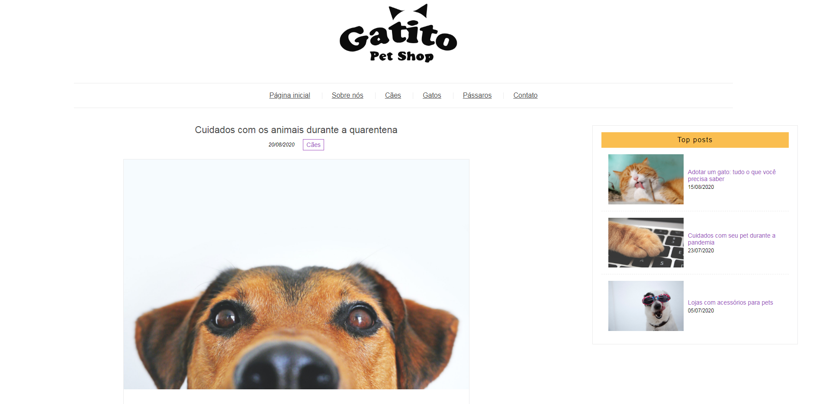

# Bootstrap

### Projeto desenvolvido para o curso de *Sass: O CSS com superpoderes* da instrutora Gabriela Vaz (Alura).

&nbsp;

A sigla SASS significa **Syntactically Awesome Style Sheets** – ou seja, Folhas de Estilo com Sintaxe Espetacular. A ideia é manter a mesma lógica do CSS, mas de uma maneira mais organizada, intuitiva e com trechos de código facilmente reutilizáveis.

&nbsp;

Objetivos do curso:

- Utilizar variáveis no código CSS;
- Aprender a estender o CSS e evitar repetições;
- Facilitar a manutenção da folha de estilo;
- Implementar funções e lógica na estilização do site;
- Tornar o site responsivo de maneira simples e reutilizável.

&nbsp;

### [Link para instalação do Sass](https://sass-lang.com/install)

&nbsp;

Clique na imagem para visualizar o site:

